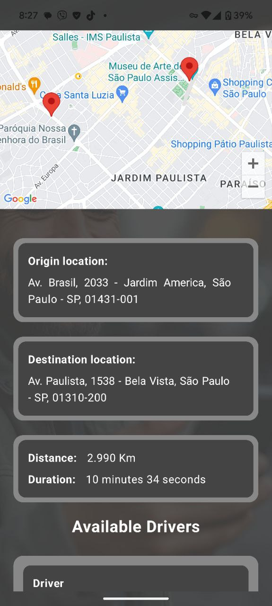

# Taxi - App

<div align="center">

| Demo                                | Description                        | Screenshot                         |
| :---------------------------------- | :----------------------------------| :----------------------------------
|       | This is a native Android application developed as part of a technical test for a ride-hailing service. It allows users to request a ride, choose between different ride options, and view their ride history. |                                       

</div>

<div  align="center">
[Technical Test PDF](app/AppDemo/Teste Técnico Mobile Novembro 2024 - App de taxi.pdf)
  </div>

  <details>
  <summary> Assignment documentation in English -> Click to expand</summary>
  <p>

Technical Test - Mobile
Hello, candidate!

First, we would like to thank you for your interest in joining the Shopper.com.br development team.  We are building the best supply system in Brazil and for that we are looking for people passionate about using technology to create innovative solutions.  We hope it's you!   

Explaining a little bit of the selection process:

Stage 1 - Technical Test
In this first phase, you will build the frontend of an application for private transport.  It will be a simple and functional application that will integrate with 3 three endpoints of a simulated API.    

Stage 2 - Technical Presentation
The best deliveries will be invited to present and participate in a more in-depth discussion about the project with the Shopper technical team.    

Stage 3 - Cultural Fit
Once your technical skills have been validated, we now want to get to know you better as a person and professional.  In this next step, you will have the opportunity to talk with our team, share your career goals and better understand our culture and way of working.  It will be an open space to exchange ideas and clarify any questions you may have about us.  In addition, we have prepared a relaxed chat so that we can get to know your values, your motivations and how you fit into our team.  We want to make sure that this opportunity is ideal for you, as much as you are for us.    

## STAGE 1 - Technical test
What you will need to know:

Read technical specifications in English and understand business requirements.    

Develop a native iOS application with swift or Android with kotlin    

The basics of versioning in a repository using Git.  

What you will be evaluated on:
Your application will be submitted to a series of tests that will verify each of the acceptance criteria.  Therefore, it is important that you carefully read and strictly follow all instructions.  Your application must fully comply with the requirements.    

Desirable points, but not eliminatory:

Unit tests.    

A clean architecture (clean code).    

How to deliver your project:
Fill in this (https://forms.gle/hitvwDAyrZDDr2556).    

The delivery will only be of the source code, it is not necessary to generate an APK or IPA of the application.    

The project must compile and run on the Android Studio or Xcode emulator in the latest version.    

The application will connect to the simulated backend of the application at the address:

https://xd5zl5kk2yltomvw5fb37y3bm40vsyrx.lambda-url.sa-east-1.on.aws.    

How you should use LLMS (Copilot, ChatGPT, Gemini, Llama, etc..)
We like and encourage those who seek innovation to become more productive, but we want to evaluate you!  Use LLM as a tool and not as the creator of your code.    

You should NOT do:

Copy this test, paste it into GPT and just copy the result.  LLMs generate bad codes.    

You can do:

Use GPT to improve the code you created or study best practices.    

## SCENARIO 
Let's develop a concept application where the user can request a private car trip from point A to point B. He will be able to choose between some options of drivers and values and confirm the trip.  Then you can also list the history of trips made.    

## BACKEND DEFINITIONS 
The backend is a simulated API, it has standardized responses that are returned according to the parameters sent.  To access the backend, use the base URL below:   

https://xd5zl5kk2yltomvw5fb37y3bm40vsyrx.lambda-url.sa-east-1.0n.aws    

The API has the following endpoints that should be used by the application:

## POST/ride/estimate
Responsible for receiving the origin and destination of the trip and performing the calculations of the trip values.  This endpoint has the following scenarios:   

| "Origin" | "Destination" | "Customer ID" | "Scenario" |
|---|---|---|---|
| "Any" | "Any" | "Any" | "Success with no driver available" |
| "Av. Pres. Kenedy, 2385 - Remédios, Osasco - SP, 02675-031" | "Av. Paulista, 1538 - Bela Vista, São Paulo - SP, 01310-200" | "Any" | "Success with 3 drivers available" |
| "Av. Thomas Edison, 365 - Barra Funda, São Paulo - 01140-000 SP" | "Av. Paulista, 1538 - Bela Vista, São Paulo - SP, 01310-200" | "Any" | "Success with 2 drivers available" |
| "Av. Brasil, 2033 - Jardim America, São Paulo - SP, 01431-001" | "Av. Paulista, 1538 - Bela Vista, São Paulo SP, 01310-200" | "Any" | "Success with 1 driver available" |
| "Any" | "Equal to origin" | "Any" | "Error destination address equal to origin" |
| "Any" | "Null" | "Any" | "Blank destination error" |
| "Null" | "Any" | "Any" | "Blank origin error" |
| "Any" | "Any" | "Null" | "Blank customer id error" | 


Request Body
```xml
JSON

{
    "customer id": string,
    "origin": string,
    "destination": string
}
```
Response Body
```xml
JSON

{
    "origin": {
        "latitude": number,
        "longitude": number
    },
    "destination": {
        "latitude": number,
        "longitude": number
    },
    "distance": number,
    "duration": string,
    "options": [
        {
           "id": number,
            "name": string,
            "description": string,
            "vehicle": string,
            "review": {
                "rating": number,
                "comment": string
            },
            "value": number
        }
    ],
    "routeResponse": object
}
```
## PATCH /ride/confirm
Responsible for confirming the trip. To use the endpoint, consider the driver table below to know when the driver ID is valid and when the distance is valid:    

| "Driver ID" | "Minimum KM accepted" |
|---|---|
| "1" | "1" |
| "2" | "5" |
| "3" | "10" |

This endpoint has the following scenarios:

| "Origin" | "Destination" | "Customer ID" | "Driver ID" | "Distance" | "Scenario" |
|---|---|---|---|---|---|
| "Any" | "Any" | "Any" | "Valid" | "Valid" | "Success" |
| "Any" | "Any" | "Any" | "Valid" | "Invalid" | "Invalid distance error for driver" |
| "Any" | "Any" | "Any" | "Invalid" | "Valid" | "Invalid driver error" |
| "Any" | "Any" | "Any" | "Null" | "Valid" | "Driver error not informed" | 
| "Any" | "Equal to origin" | "Any" | "Valid" | "Valid" | "Address error of destination equal to origin" |
| "Any" | "Null" | "Any" | "Valid" | "Valid" | "Blank destination error" |
| "Null" | "Any" | "Any" | "Valid" | "Valid" | "Origin error blank" |
| "Any" | "Any" | "Null" | "Valid" | "Valid" | "Customer id error in target" |

Request Body
```xml
JSON
{
    "customer id": string,
    "origin": string,
    "destination": string,
    "distance": number,
    "duration": string,
    "driver": {
        "id": number,
        "name": string
    },
    "value": number
}
```

Response Body

| "Status Code" | "Description"                                          | "Response"                                                                     |
|---------------|------------------------------------------------------|---------------------------------------------------------------------------------|
| "200"         | "Operation performed successfully"                     | `{ "success": true }`                                                         |
| "400"         | "The data provided in the body of the request is invalid" | `{ "error_code": "INVALID_DATA", "error_description": string }`             |
| "404"         | "Driver not found"                                     | `{ "error_code": "DRIVER NOT FOUND", "error_description": string }`            |
| "406"         | "Invalid mileage for the driver"                       | `{ "error_code": "INVALID DISTANCE", "error description": string }`            |

## GET/ride/{customer_id}?driver_id={driver id}

Responsible for listing trips made by a certain user

This endpoint has the following scenarios (consider the same driver IDs as the trip confirmation endpoint):

| "Customer ID" | "Driver ID" | "Scenario" |
| --- | --- | --- |
| "СТО1" | "Null or valid" | "Success with random list of trips" |
| "Any" | "Null or valid" | "Error with no trips saved" |
| "СТО1" | "Invalid" | "Invalid driver error" |

Response Body


| "Status Code" | "Description" | "Response" |
| --- | --- | --- |
| "200" | "Operation performed successfully" | "{ "customer_id": string, "rides": \[ { "id": number, "date": datetime, "origin": string, "destination": string, "distance": number, "duration": string, "driver": { "id": number, "name": string }, "value": number } ] }" |
| "400" | "Invalid driver" | "{ "error_code": "INVALID DRIVER", "error_description": string }" |
| "404" | "No records found" | "{ "error_code": "NO RIDES FOUND", "error_description": string }" |


# FRONTEND DEFINITIONS

The Frontend must be a native application, consider the points below:

On Android:

*   Use Kotlin for development.
   
*   You can choose to create the screens in XML or Compose, whichever you prefer.

On iOS:

*   Use Swift for development.
   
*   You can choose to create the screens in UIKit or SwiftUI, whichever you prefer.

## Functionalities and animations:

*   We will evaluate the requirements described in this document, ensure that they are working correctly.
   
*   You can add animations, screen transitions or more refined layouts if you want, however they will not be considered as eliminatory during the evaluation.

The application must have the following screens and behaviors:

## Travel request

*   It must contain a form with the fields to inform the user's id, the origin address and the destination address and a button to estimate the value of the trip.
   
*   You must make the request to the API passing the necessary parameters, upon receiving the response you must display the travel options screen.

## Travel options

*   Must show a static map with the route returned in the plotted estimate, indicating point A and point B. 
   
*   Must show the list of driver options with:
   
    *   name. 
       
    *   description. 
       
    *   vehicle. 
       
    *   evaluation. 
       
    *   value of the trip.
       
*   For each driver there must be a "Choose" button, which will make the request to the API and confirm the trip.
   
*   After confirming the trip, you must automatically forward to the trip history screen.

## Travel history

*   Must show a field to inform the user's id, a driver selector, with an option to show all and a button to apply the filter.
   
*   When applying the filter, it must display the list of trips made, with:
   
    *   date and time of the trip. 
       
    *   driver's name. 
       
    *   origin. 
       
    *   destination. 
       
    *   distance. 
       
    *   weather. 
       
    *   value.

## Error handling and user feedback

*   On all screens, errors must be displayed to the user, allowing him to verify the problem and try again.
   
*   Whenever there is a slower processing, such as a request, it should be presented to the user that the application is performing an action. 
   
*   The application should prevent the user from performing repeated actions by mistake when tapping a button several times (debounce).

--------------------------------------------------------------------------------------------------------------------------------------------------

</p>
</details>

 


## Features

*   Request a ride by specifying the origin and destination addresses.
*   View the ride in a static map.
*   View available ride options with details about the driver, vehicle, and estimated fare.
*   Confirm a ride and automatically add it to the ride history.
*   View past rides with details about the date, time, driver, and fare.
*   Error handling for various scenarios, providing the API messages for each case or using custom informative messages to the user.
*   Debouncing to prevent accidental multiple requests.
*   Filter by driver to display the appropriate data from the random data the API sends.
*   Sort by date to display the history data in chronological order as it should appear, regardless of the order of the random data the API sends.
*   For testing purposes, there is an autocomplete function for the default API customer, origin, and destination.
*   For testing purposes, a fake driver instance is added to confirm the error handling case.
*   In ride history, labels are added to the cards to demonstrate if the ride is from the local database or from the random data the API sends.

## Technical Details

The app was built using Kotlin and Jetpack Compose, following Clean Architecture principles and the MVI (Model-View-Intent) pattern. 
It uses the following libraries and technologies:

*   **Room Database:** For persisting ride history data locally.
*   **Dagger Hilt:** For dependency injection.
*   **Ktor:** For making API calls to the backend.
*   **Kotlin Coroutines:** For managing asynchronous operations.
*   **Jetpack Compose:** For building the user interface.
*   **Google Maps:** For showing a static map of the origin and destination.

The app also includes Unit Tests to ensure the correctness of the core logic.

## Project Structure

                                    +---------------------+
                                    |    Presentation     |
                                    +---------------------+
                                    |  screens(ViewModels)|
                                    |  common             |
                                    |  navigation         |
                                    +---------------------+
                                             ^
                                             |
                                    +---------------------+
                                    |       Domain        |
                                    +---------------------+
                                    |   usecases          |
                                    |   model             | 
                                    |   error             |
                                    |   repository        |
                                    |   remote            |
                                    +---------------------+
                                             ^
                                             |
                                    +---------------------+
                                    |        Data         |
                                    +---------------------+
                                    |  mapper             |
                                    |  model              |
                                    |  repository(error)  | 
                                    +---------------------+
                                             |
                                             |
                                    +---------------------+
                                    |      Source         |
                                    +---------------------+
                                          /         \
                                         /           \
                                        /             \
                                +----------+       +----------+
                                |  Local   |       |  Remote  | 
                                +----------+       +----------+
                                |  room    |       | API(Ktor)| 
                                +----------+       +----------+

## API Integration

The app interacts with a simulated backend API that provides endpoints for estimating ride fares, confirming rides, and retrieving ride history. The API endpoints and their specifications are as follows:

*   **POST /ride/estimate:** Calculates the estimated fare for a ride based on the origin and destination addresses.
*   **PATCH /ride/confirm:** Confirms a ride with a selected driver.
*   **GET /ride/{customer_id}:** Retrieves the ride history for a given customer.
*   **GET /ride/{customer_id}?{driver_id}:** Retrieves the ride history for a given customer and driver.

## Error Handling

The app includes robust error handling to address various scenarios, such as:

*   Invalid input data.
*   Network errors.
*   Server errors.
*   No available drivers.
*   Distance limitations for certain drivers.
*   Failure to save rides to the database.


## How to Run

1.  Clone the repository
2.  Open the project in Android Studio
3.  Build and run the app on an emulator or device
4. Use your own Google Maps API key to the manifest file in the "google_maps_api" property:
```xml
<meta-data
    android:name="com.google.android.geo.API_KEY"
    android:value="${google_maps_api}" />
```

## Conclusion

This project demonstrates the core concept of a well-structured, maintainable, scalable, and functional Android application using modern technologies, 
clean code, clean architecture, MVI and best practices.
